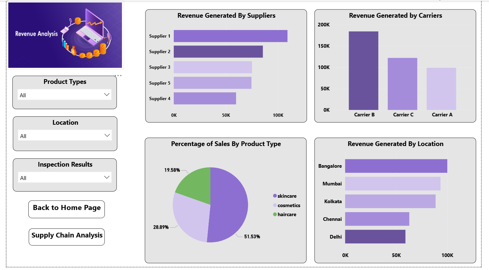

# 📦 Supply Chain Analytics Dashboard

## 🚀 Overview
This project focuses on analyzing and optimizing the supply chain of a fashion & makeup company using data-driven techniques.

It combines **ETL (Python)**, **Snowflake (Data Warehouse)**, and **Power BI (Visualization)** to transform raw supply chain data into actionable business insights.

---

## 🧠 Key Objectives
- Improve **demand planning & inventory management**
- Analyze **lead times, shipping performance, and supplier efficiency**
- Identify **cost optimization opportunities**
- Enable **data-driven decision-making**

---

## 🛠️ Tech Stack
- **Python** – Data Cleaning & ETL  
- **Snowflake** – Data Warehousing  
- **Power BI** – Dashboard & Visualization  

---

## ⚙️ Workflow
1. **Extract & Transform**
   - Cleaned and processed raw data using Python  
   - Handled missing values & structured datasets  

2. **Load**
   - Loaded transformed data into **Snowflake**  

3. **Visualize**
   - Built an interactive **Power BI dashboard** with key KPIs  

---

## 📊 Key Insights Delivered
- 📉 Inventory vs Demand mismatch analysis  
- 🚚 Shipping delays & cost breakdown  
- 🏭 Supplier performance tracking  
- ⚠️ Defect rates & quality insights  

---

## 📸 Dashboard Preview

---

